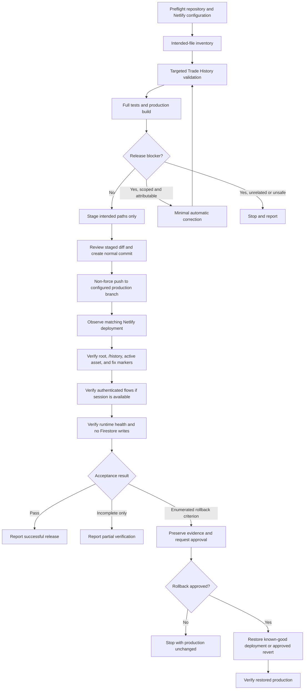

# Deploy Trade History Fix Design

## Overview

This design defines a controlled, branch-triggered production release of the completed `trade-history-black-screen` fix to `https://vijaycontractor.space`. It does not redesign or reimplement the application fix. The release flow establishes a repository and Netlify baseline, validates the intended change, permits only minimal automatic remediation of release-blocking failures attributable to the intended release, creates a normal narrowly scoped commit, pushes without force to the configured production branch, observes the resulting Netlify deployment, and performs read-only production acceptance.

The normal deployment commit and push are already authorized. Force push, history rewriting, destructive Git operations, secret handling, production data mutation, and automatic production rollback are outside that authorization. A rollback is a separate high-impact action gated by both an enumerated failure and explicit approval unless the exact rollback was already unambiguously authorized.

## Scope and Constraints

### In Scope

- Trade History fix source paths confirmed by repository inspection
- Approved Trade History tests and test configuration
- The completed `trade-history-black-screen` specification and this deployment specification when intended for the release
- One-shot targeted tests, full tests, and production build
- Small release-blocking corrections directly attributable to those intended paths or validation configuration
- Normal commit, non-force push, branch-triggered Netlify deployment, and read-only production verification

### Out of Scope

- Unrelated staged, unstaged, or untracked work
- Feature enhancements, refactors, dependency upgrades, or broad cleanup
- Manual upload deployment
- Force push, reset, clean, branch deletion, history rewriting, or hook bypass
- Reading, printing, committing, or transmitting secrets
- Production Firestore writes or production test fixtures
- Automatic production rollback without the approval required by Requirement 8.4

## Release Architecture



## Components and Responsibilities

### 1. Preflight Inspector

The preflight step uses read-only repository and configuration commands to establish:

- repository root and current branch;
- upstream and configured Git remotes;
- local/remote relationship without changing either;
- staged, unstaged, and untracked paths;
- recent commits relevant to the fix;
- `netlify.toml` build command (`npm run build`), publish directory (`dist`), and SPA rewrite;
- linked Netlify site and configured production branch through authenticated tooling when available;
- completion and recorded validation in `.kiro/specs/trade-history-black-screen/`.

Any mismatch in branch, upstream, production-branch configuration, or unexplained work is a stop condition. Preflight must not use commands that mutate the index, worktree, branch, remote, or deployment.

### 2. Intended-File Inventory

The inventory is an explicit allowlist built from the actual Trade History fix diff and approved artifacts, not a blanket directory selection. Candidate paths include `src/pages/TradeHistory.jsx`, `src/utils/tradeHistoryViewModel.js`, Trade History files under `tests/trade-history/`, relevant `package.json` scripts, `.kiro/specs/trade-history-black-screen/`, and `.kiro/specs/deploy-trade-history-fix/`, but each path must be justified by inspection before inclusion.

Every other changed path is classified as unrelated and preserved exactly as found. Generated `dist/`, local `.netlify/` state, environment files, logs, browser profiles, and credentials are not release payloads.

### 3. Validation and Constrained Remediation

Validation proceeds from narrow to broad:

1. `npm run test:trade-history:exploration`
2. `npm run test:trade-history:preservation`
3. `npm run test:trade-history`
4. `npm test`
5. `npm run build`

Commands are one-shot; no development server, watcher, or interactive process is used. The production build's entry asset is recorded. Although `/assets/index-BqALrodG.js` is the previously recorded artifact, content hashing may legitimately produce another filename after an approved correction.

Automatic remediation is permitted only when a failing test/build blocks this release and the cause is directly attributable to the intended Trade History source, tests, specification, or validation configuration. The correction must be the smallest safe change. It is added to the inventory, reviewed, and followed by rerunning the failed check and all checks downstream from it. Unrelated failures, secret-dependent fixes, deployment-scope changes, dependency upgrades, and destructive remedies cause a stop and report.

### 4. Commit and Push Controller

Staging uses explicit allowlisted paths only. Before commit, the operator reviews the staged path list, full staged diff, summary, and potential secret-bearing names/content. Unrelated changes remain unstaged and untouched. The operator then creates a normal commit, records its SHA, and pushes without force to the upstream branch confirmed to be Netlify production.

The release commit is valid only if the remote production branch resolves to the same SHA after push. Existing authorization covers this normal commit and push, so no duplicate approval is requested. It does not cover force push, amend/history rewriting, hook bypass, or destructive Git operations.

### 5. Netlify Deployment Observer

The observer uses whatever authenticated mechanism is already available—Netlify CLI, API, dashboard, or browser session—to identify the production deployment created from the push. Credentials are consumed only by the authenticated tool and are never printed or copied into evidence.

Recorded evidence includes deployment ID/URL, source commit, branch/context, timestamps, and final state. Production acceptance is gated on a successful published production deployment matching the release SHA. A missing, failed, canceled, mismatched, or unverifiable deployment stops live acceptance.

### 6. Production Acceptance Verifier

The verifier performs read-only checks:

- root URL returns the SPA entry;
- direct `/history` returns the SPA rather than a routing error;
- the entry document's active JavaScript asset returns successfully and belongs to the matching deployment;
- the active asset contains `Trade History`, `Unknown`, `Something went wrong`, `React Error Boundary caught:`, `Reload App`, and `Try Again`;
- with an existing authenticated session or approved account, Dashboard `View All` and direct `/history` show the shell and Trade History without a black screen or boundary fallback;
- console/runtime evidence contains no fix-related exception or asset failure;
- network/runtime evidence shows no Firestore write during the verification interval.

If no authenticated session is available, the operator records those checks as not executed, does not request or expose credentials, and does not claim complete authenticated acceptance. A naturally occurring heterogeneous trade may demonstrate the `Unknown` fallback; no production record may be created or changed to manufacture that condition.

### 7. Outcome and Rollback Gate

Rollback is considered only for Requirement 8.1 failures. Before any rollback, the operator preserves sanitized evidence and identifies the immediately preceding known-good deployment. Because rollback affects production, the operator presents the evidence, proposed target, impact, and recovery method and obtains explicit approval unless that exact action was already authorized.

The preferred approved recovery is restoring the immediately preceding known-good Netlify deployment. A repository revert is a fallback only when restoration is unavailable and the revert is explicitly approved; it uses a normal revert commit and non-force push while preserving unrelated work. After recovery, root and direct `/history` reachability are rechecked. Deployment recovery never implies Firestore data restoration.

## Data and Evidence Model

A release record should capture only non-secret operational evidence:

```text
ReleaseRecord
  repositoryRoot
  localBranch
  upstreamBranch
  netlifyProductionBranch
  intendedPaths[]
  unrelatedPaths[]
  validationResults[] { command, status, timestamp, artifact }
  releaseCommitSha
  remoteCommitSha
  netlifyDeployment { id, url, sourceCommit, context, startedAt, completedAt, status }
  productionAssetUrl
  routeChecks[] { url, status, observation }
  markerChecks[] { marker, present }
  authenticatedChecks[] { flow, status, observation }
  runtimeChecks[] { consoleHealthy, uncaughtErrors, assetFailures }
  firestoreWriteCheck { observedWriteCount, evidenceSource }
  outcome
  rollbackEvidence
```

No token, cookie, password, service-account value, `.env` content, or personally identifying production trade data belongs in this record. Console and network evidence must be sanitized before recording.

## Safety Invariants

1. **Unrelated-work invariant:** paths outside the reviewed inventory are not edited, staged, committed, reverted, or cleaned.
2. **History invariant:** deployment uses a normal commit and non-force push; no existing history is rewritten.
3. **Secret invariant:** credentials remain within authenticated tooling and are absent from command output, diffs, commits, and evidence.
4. **Deployment identity invariant:** live acceptance applies only to a published production deployment whose source SHA equals the pushed release SHA.
5. **Read-only invariant:** production verification issues zero Firestore writes.
6. **Rollback invariant:** rollback requires an enumerated failure and separate approval unless the exact rollback action was already explicitly authorized.

## Error Handling and Decision Rules

| Condition | Required response |
|---|---|
| Branch/upstream/Netlify production branch mismatch | Stop before staging and report |
| Unclassified or unrelated work | Preserve it; exclude it from inventory and commit |
| Intended release test/build failure | Apply smallest safe correction, then revalidate |
| Unrelated, secret-dependent, or broad failure | Stop without correcting it |
| Commit/hook/push/remote SHA failure | Stop; do not claim deployment |
| Netlify deployment missing, failed, canceled, mismatched, or unverifiable | Stop live acceptance and preserve evidence |
| No authenticated browser session | Record authenticated checks as not executed; do not seek credentials or claim full acceptance |
| Route, artifact, black-screen, fix-runtime, or Firestore-write criterion fails | Stop, preserve sanitized evidence, request rollback approval |
| Rollback not approved | Leave production unchanged and report the failure |
| Rollback approved | Restore known-good deployment, or use explicitly approved normal revert fallback |

## Correctness Properties

Property 1: Preflight Isolation

_For any_ working tree containing intended and unrelated changes, preflight and inventory creation SHALL identify the configured release path and ensure all unrelated paths remain byte-for-byte unmodified and unstaged.

**Validates: Requirements 1.1, 1.2, 1.3, 1.4, 1.5, 1.6**

Property 2: Validation-Gated Release

_For any_ release candidate, staging SHALL occur only after targeted tests, full tests, and the production build pass; any automatic correction SHALL be minimal, release-blocking, attributable to the intended release, and fully revalidated.

**Validates: Requirements 2.1, 2.2, 2.3, 2.4, 2.5**

Property 3: Intended-Only Commit Identity

_For any_ approved release candidate, the created normal commit SHALL contain only reviewed intended paths, the non-force push SHALL target the configured upstream production branch, and the remote SHA SHALL equal the recorded release SHA.

**Validates: Requirements 3.1, 3.2, 3.3, 3.4, 3.5, 3.6**

Property 4: Deployment-to-Asset Traceability

_For any_ pushed release SHA, live acceptance SHALL inspect only a successful published production deployment sourced from that SHA, and the active successful asset SHALL contain every required fix marker.

**Validates: Requirements 4.1, 4.2, 4.3, 4.4, 4.5, 5.1, 5.2, 5.3, 5.4, 5.5**

Property 5: Read-Only Production Health

_For any_ executed production verification flow, root and History observations SHALL produce no fix-related uncaught runtime or asset failure and SHALL issue zero Firestore writes; authenticated behavior is asserted only when an existing approved session is available.

**Validates: Requirements 6.1, 6.2, 6.3, 6.4, 6.5, 7.1, 7.2, 7.3, 7.4, 7.5**

Property 6: Approved Rollback Only

_For any_ release outcome, production rollback SHALL occur only when an enumerated failure is proven and the exact high-impact recovery action is approved; otherwise production remains unchanged and the outcome is reported accurately.

**Validates: Requirements 8.1, 8.2, 8.3, 8.4, 8.5, 8.6, 8.7**

## Verification Strategy

Verification is evidence-based rather than implementation-test based. Each leaf task records its inputs, commands or tooling, result, and blockers without secrets. Dependency gates prevent a later task from running when an earlier prerequisite fails. The final outcome distinguishes successful, partially verified, blocked, failed, and rolled-back releases rather than treating missing evidence as success.
